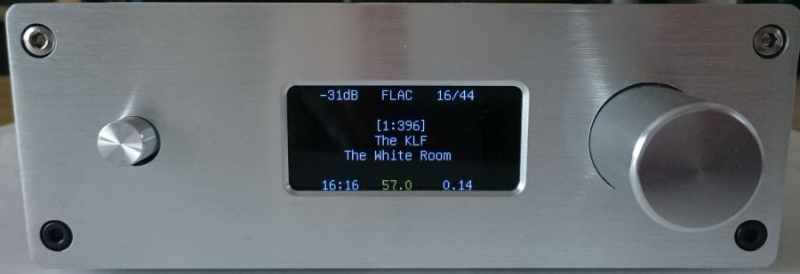

# dac

a MPD + DAC Controller for *Pi Boards

# Features

* written in plain C using eclipse CDT
* running on many ARM Boards (tested on Raspberry 2, Odroid C2, Nanopi Neo Plus2, even on x86)
* modular concept and easy to enhance by auto-registering in main program (see [template.c](template.c))
* DAC connection via XMOS / Amanero USB device or I2S
* MPD player + playlist support
* command input via infrared, rotary encoder, console 
* hardware controlled volume up / down + input selection
* hardware(!) replaygain support for FLAC and MP3
* fbtft display support + ncurses menu control
* MQTT Support for controlling [Tasmota](https://tasmota.github.io/) devices, e.g. lights, shutters. sensors, etc.
* I2C PCF8574X connected LCD Displays and Buttons 
* control wireless [Flamingo](https://www.flamingo.eu/en-gb/flamingo-products/) wall plugs and webcam by environment luminosity
* surplus power and storage management of [sunspec](https://sunspec.org/)-compatible PV inverters via modbus/api (Fronius, SMA, ...)

# News

Jan 2025 PV surplus power management

Aug 2023 insert [picam](https://github.com/teknoid/picam) functionality

Mar 2023 home automation via MQTT

Feb 2019 joined github

Jun 2018 git project

??? 2016 project start  

# Devices currently supported

### Piwolf 

[front](pics/piwolf-front.jpg) [top](pics/piwolf-top.jpg)

* Raspberry with [Audiophonics WM8741](https://www.audiophonics.fr/en/diy-dac/audiophonics-wm8741-dac-volume-controller-wm8805-wm8741-p-7573.html) Board
* Volume control via LIRC receive and LIRC send (electrically) to DAC Board
* very very sensitive to powerline interferences, e.g refrigerator switching on, either muting or setting volume to 100% - very dangerous an unpredictable ;-) 

### Sabre18 

[front](pics/sabre18-front.jpg) [top](pics/sabre18-top.jpg)

* Nanopi Neo+2 with Audiophonics ES9018 Board (not available anymore) connected by XMOS module
* 1 TB 2.5" hard disk
* DAC mikrocontroller is soldered onboard, no chance to access I2C without hacking the board, e.g. de-soldering I2C lines from controller. Doing that I burnt a board to hell :-( 
* volume control by simulating button press via GPIO lines

### Sabre28 

[front](pics/sabre28-front.jpg) [top](pics/sabre28-top.jpg)

* Nanopi Neo+2 with China ES9028 Board [similiar like this](https://www.audiophonics.fr/en/diy-dac/ess-es9038pro-dac-module-i2s-xlr-32bit-384khz-dsd-with-screen-and-remote-control-p-12705.html) connected via Amanero module
* separate control unit - so we can easily disconnect it and control the DAC via I2C lines from Pi, yeah!
* [Joy-It TFT Display](http://anleitung.joy-it.net/?goods=1-8-tft-lcd-st7735) connected vis SPI and fbtft driver

### Anus

* my Asus laptop - MPD play & playlist control via infrared

# Usage

__Warning!__ This is no "ready to use" software. You need to modify and compile this software to fit your needs. Here are some basic steps when you want to start with that project:

Install dependencies:

```bash
apt install jq ir-keytable libmpdclient-dev libmagic-dev libid3tag0-dev libflac-dev libncurses-dev libcurl4-openssl-dev libmodbus-dev
```
Install wiringpi - this is board specific, either use repository or compile from vendor gitgub.

Clone dac repository:

```bash
git clone https://github.com/teknoid/dac.git
```
Configure DEVINPUT to use infrared and rotary encoder

```bash
cp misc/*.rules /etc/udev/rules.d/
armbian-add-overlay misc/gpio-rotary.dts
```
After reboot check input devices. You should have speaking names linked to phys devices like this:

```bash
ls -la /dev/input
total 0
drwxr-xr-x  3 root root     200 Jan 31 16:06 .
drwxr-xr-x 15 root root    3920 Jan 31 16:06 ..
drwxr-xr-x  2 root root     100 Jan 31 16:06 by-path
crw-rw-rw-  1 root input 13, 64 Jan 31 16:06 event0
crw-rw-rw-  1 root input 13, 65 Jan 31 16:06 event1
crw-rw-rw-  1 root input 13, 66 Jan 31 16:06 event2
lrwxrwxrwx  1 root root       6 Jan 31 16:06 infrared -> event2
crw-rw-rw-  1 root input 13, 63 Jan 31 16:06 mice
lrwxrwxrwx  1 root root       6 Jan 31 16:06 rotary_axis -> event1
lrwxrwxrwx  1 root root       6 Jan 31 16:06 rotary_button -> event0
```
Map infrared remote control keys to DEVINPUT key names

```bash
cp misc/universum /etc/rc_keymaps
ir-keytable -c -w /etc/rc_keymaps/universum

```
Configure target board and hardware settings by uncommenting resp. entry in in mcp.h 

```c
// #define ANUS
// #define PIWOLF
// #define SABRE18
#define SABRE28
```
Compile

```bash
make clean && make
make <target>
```
Run in interactive mode (console input):

```bash
./mcp -i
```
Install a systemd service unit:

```bash
make install-service
```
Install and run mcp as systemd service:

```bash
make install
```